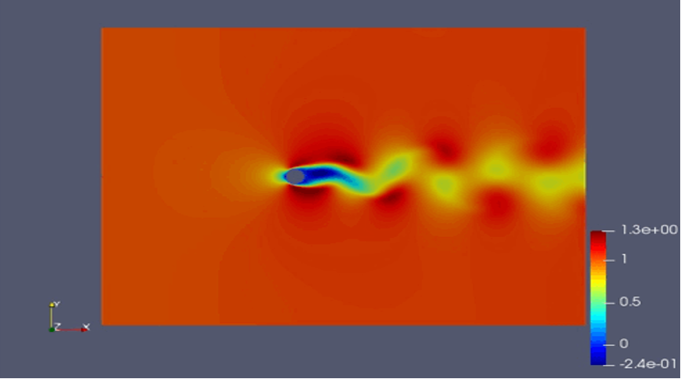

# 2D unsteady cylinder flow

This guide introduces how to build a PINN model with continuous time method for simulating 2d unsteady cylinder flow in PaddleScience.

## Use case introduction

The 2d unsteady cylinder flow example simulate solution (pressure and velocity) of following problem

    

Following graphs plot the horizional velocity from training the model on given node from openFoam.

    

The result which is simulated through PINNs is showned as below, and the result is almost the same as the result from openfoam

    

## How to run the model 

### Model composition

The model contains 4 main parts, which are datasets, pinn_solver, train or predict code, dataload module.

### Run model

 **a. Download PaddleScience code**
 
        
   - Confirm working directory
        
   - Downlaod paddlescience code from  [github](https://github.com/PaddlePaddle/PaddleScience), git clone is also worked by the following code:   
        
    git clone https://github.com/PaddlePaddle/PaddleScience.git

 **b. Install dependent libraries**
 
    
   - Rename the folder name as PaddleScience if not
    
   - Change working directory to PaddleScience
    
   - Install dependent libraries by `pip install -r requirements` 
    
 **c.Set environment variables**
 
    
   **-Set environment** 
    
   Setting environment by `%env PYTHONPATH=/user_path*/PaddleScience`, and if editing bash files, using `export PYTHONPATH=$PYTHONPATH:/user_path*/PaddleScience/` instead
 
 **d. Start simulation**
 
    
   **-Loading data**
   
   
   The trainning data and supervised data were came from openFoam, and loaded before simulation.

    # Loading data from openfoam 
    path = './examples/cylinder/2D_unsteady/datasets/'
    dataloader = cfd.DataLoader(path=path, N_f=9000, N_b=1000, time_start=1, time_end=50, time_nsteps=50)
    training_time_list = dataloader.select_discretized_time(num_time=30)
    
   **-Define fluid properties**
   
    
   Before starting a 2d unsteady cylinder flow simulation, we set up the flow domain as below, and the grid was loaded from openFoam. 
    
    
    
    

    
   The fluid propery can be defined by nu which means the fluid viscosity, Based on the Reynolds number equation `Re=U*D/nu`, the default inlet velocity is constant 2, and the Reynolds number can be changed by changing the viscosity only. 
   In this model, the default Reynolds number is 100, and the cylinder diameter is 1, so the viscosity can be 0.02.
    
   **-Define Loss weight**
   
    
   Loss function consist of eq_loss, bc_loss, ic_loss, outlet_loss and supervised_data_loss, and each of these terms has a weight. The weight of each items can be changed when training.

    PINN = psolver.PysicsInformedNeuralNetwork(
        layers=6, nu=2e-2, bc_weight=10, eq_weight=1, ic_weight=10, supervised_data_weight=10, 
        outlet_weight=1, training_type='half-supervised', checkpoint_path='./examples/cylinder/2D_unsteady/checkpoint/', 
        net_params=net_params, distributed_env=distributed_env)

   **-Define training parameters**
   
    
   By default, a fully connected neural network is used, and the network information is defined as 10* 50：

    def initialize_NN(self, num_ins=3, num_outs=3, num_layers=10, hidden_size=50):
        return psci.network.FCNet(
            num_ins=num_ins,
            num_outs=num_outs,
            num_layers=num_layers,
            hidden_size=hidden_size,
            dtype="float32",
            activation='tanh')

   Adam is currently selected as the optimizer, and default training epoch numbers and learning rate are as follow:

    adm_opt = paddle.optimizer.Adam(learning_rate=1e-5, parameters=PINN.net.parameters())
    PINN.train(num_epoch=10, optimizer=adm_opt)
    
   **-Training Model**
   
   
   This use case has provided the pre-trained network and saved it in the checkpoint folder. The pre-trained network can be used to continue training when defining ` net_params = './examples/cylinder/2D_unsteady/checkpoint/pretrained_net_params'` in cylinder2d_unsteady_train.py, and if set` net_params = None`，a whole new training process is about to begin。
      
    net_params = './examples/cylinder/2D_unsteady/checkpoint/pretrained_net_params'
    train(net_params=net_params)
   
   **-Predictint Model**
   
   
   After the training, the optimal network will be generated and saved in checkpoint. Selecting the network and execute`python cylinder2d_unsteady_train.py`.
   While predicting, vtk files can be generated and saved in vtk folder. these *vtu* files can be showen in as datas and graphs by importing [Paraview](https://www.paraview.org/).

    if __name__ == "__main__":
        net_params = './examples/cylinder/2D_unsteady/checkpoint/pretrained_net_params'
        vtk_filename = './examples/cylinder/2D_unsteady/vtk/uvp_t_'
        predict_once_for_all(net_params=net_params, vtk_filename=vtk_filename)

